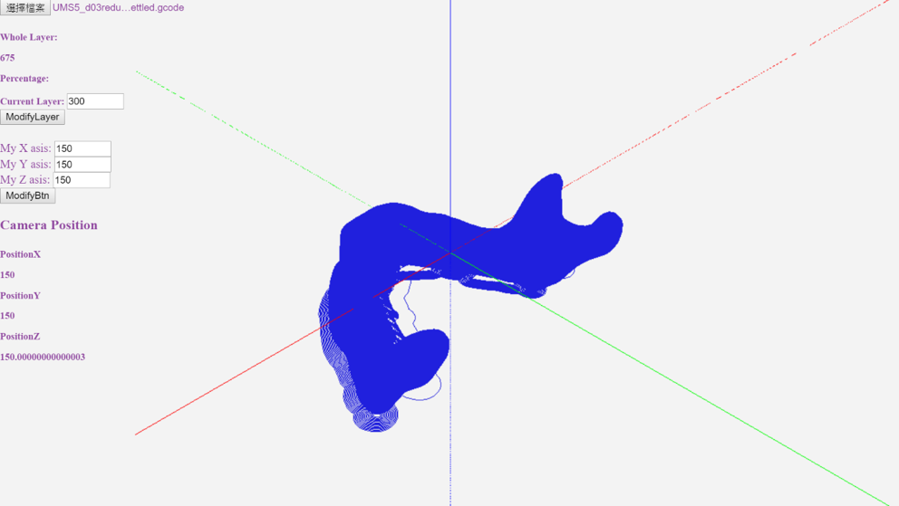
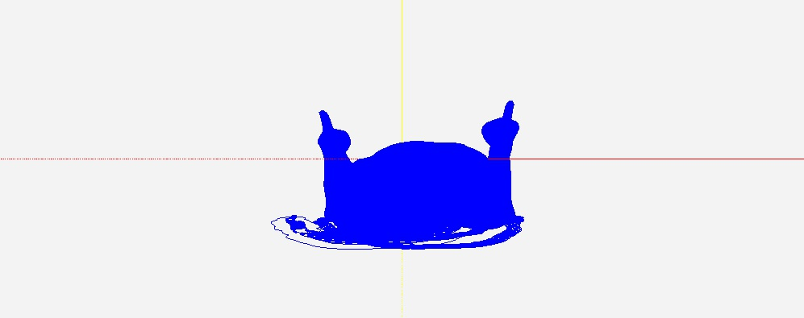
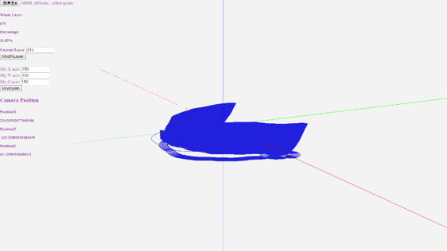

# Gcode-Object-Monitor

## Gcode file display program
Gcode-Object-Monitor is a program that can help you display the Gcode file and show any angle of the object. It contains GcodeViewer and GcodeLoader. This project is build by Flask framework. And you can use Docker enviroment to build up this project. 

1. Clone this project.
2. Type docker-compose up --build -d on docker cli.
3. Open https://locahost:5000/ on the website.

Here is the demo video link：
https://youtu.be/EK8IJphP_RU

## GcodeViewer
GcodeViewer allows user to view the Gcode file when start 3D-printing.

You can also adjust any angle you want.

## GcodeLoader
GcodeLoader allows user load any Gcode file in this program, and can display any layer you want on Gcode file.

show gcodefile with 215 layers

## Gcode-Object-Monitor Lobby
Let take a closely look to the show screen. We have some detail in the left column.  
+ Select file 
    - Select the Gcode file you want to show it to the screen.
+ Whole Layer 
    - As we know, Gcode object is stacked by several layers. It show the whole layers of this Gcode file.
+ Percentage 
    - Currently number of layers divie by the whole layers.
+ Current Layer 
    - Currently stacked of layers of the Gcode object. 
+ My X, Y, Z asis 
    - You can lock the perspective as you want.
+ Camera Position 
    - The current relative position of the camera.
